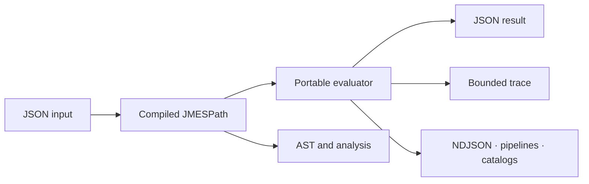

<div align="center">
  
</div>

<div align="center">
  <br>
  <a href="https://github.com/CaptainK-65/moon-jmespath/releases/tag/v0.2.0"></a>
  <a href="https://github.com/CaptainK-65/moon-jmespath/actions/workflows/ci.yml"></a>
  <a href="https://captaink-65.github.io/moon-jmespath/"></a>
  <a href="LICENSE"></a>
</div>

<p align="center">
  A reusable, portable <strong>JMESPath 1.0</strong> query toolkit for MoonBit.<br>
  Compile, inspect, trace, and transform JSON across Wasm, Wasm GC, JavaScript, and Native.
</p>

<p align="center">
  <a href="https://captaink-65.github.io/moon-jmespath/"><strong>Open the Playground</strong></a>
  ·
  <a href="https://github.com/CaptainK-65/moon-jmespath/releases/tag/v0.2.0"><strong>Download v0.2.0</strong></a>
  ·
  <a href="README.mbt.md"><strong>Read the checked API guide</strong></a>
</p>

---

## Built as infrastructure, not a product silo

MoonJMES provides a compact query language boundary for any MoonBit application
that works with JSON. The core stays independent from browsers, databases, and
product-specific schemas; the CLI, data utilities, and visual Playground are
consumers of the same reusable library.

| Layer | What it provides |
| --- | --- |
| **Query core** | Lexer, projection-aware parser, evaluator, standard functions, limits, and structured errors |
| **Reusable engine** | Bounded LRU cache, custom functions, batch isolation, runtime metrics, and trace evaluation |
| **Developer tooling** | Source diagnostics, JSON AST export, query plans, static analysis, and bounded traces |
| **Data workflows** | Compile-once NDJSON transforms, named query catalogs, and multi-stage pipelines |
| **Visual client** | Static MoonBit-backed Playground with results, AST, plan metrics, diagnostics, and trace timeline |



## Quick start

After publication to mooncakes.io:

```shell
moon add CaptainK-65/jmespath
```

```mbt
let input = try! @json.parse(
  "{\"people\":[{\"name\":\"Ada\",\"age\":36},{\"name\":\"Lin\",\"age\":15}]}",
)

let query = try! @jmespath.compile("people[?age >= `18`].name")
json_inspect(try! query.search(input), content=["Ada"])
```

The same implementation runs on all four stable MoonBit backends. Public
failures are catchable `JmesError` values, and configurable limits bound parser
and evaluator work for untrusted queries.

## Verified interoperability

- **908** attributed upstream JMESPath compliance cases, with no allowlist or
  expected failures.
- **54 tests × 4 backends**: Wasm, Wasm GC, JavaScript, and Native.
- **3,600 lines** of non-test, non-generated production MoonBit source.
- Coverage, benchmark, JavaScript export, headless-browser, Pages, and tagged
  release gates run in GitHub Actions.

The complete Issue → PR → Actions traceability matrix is available on the
[v0.2.0 Release page](https://github.com/CaptainK-65/moon-jmespath/releases/tag/v0.2.0)
and in [`docs/RELEASE_EVIDENCE.md`](docs/RELEASE_EVIDENCE.md).

## Explore the repository

- [`README.mbt.md`](README.mbt.md) — type-checked API guide and verification commands
- [`docs/ARCHITECTURE.md`](docs/ARCHITECTURE.md) — component and safety boundaries
- [`docs/COMPLIANCE.md`](docs/COMPLIANCE.md) — upstream corpus policy
- [`docs/BENCHMARKS.md`](docs/BENCHMARKS.md) — reproducible performance baseline
- [`playground/`](playground/) — MoonBit model, JS bridge, and static visual client

## License

Licensed under [Apache-2.0](LICENSE). The MIT-licensed compliance fixtures are
attributed in [`THIRD_PARTY_NOTICES.md`](THIRD_PARTY_NOTICES.md).
